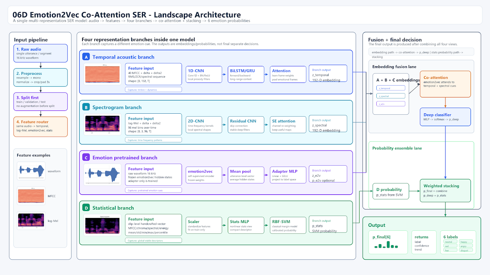
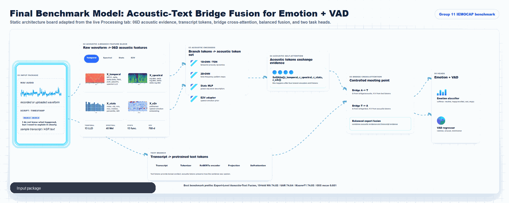

# An Acoustic-Text Fusion Approach for Predicting Categorical and Dimensional Speech Emotions

Group 11 final project for the **Speech Processing** course. This repository contains notebooks, data-processing scripts, model experiments, reports, and a local web demo for speech emotion recognition (SER) and Valence-Arousal-Dominance (VAD) regression.

The project is developed in two connected stages:

- **Midterm stage:** acoustic-only SER on RAVDESS, CREMA-D, TESS, and SAVEE to study handcrafted acoustic features, multi-branch modeling, and the difference between random split and strict speaker-independent split.
- **Final stage:** IEMOCAP-based multi-task learning with acoustic features, emotion2vec-style speech representations, transcript encoding, acoustic-text bridge fusion, and expert-level fusion.

## Table of Contents

- [Highlights](#highlights)
- [Core Model Lineage](#core-model-lineage)
- [Research Tasks](#research-tasks)
- [Datasets](#datasets)
- [Model Overview](#model-overview)
- [Benchmark Results](#benchmark-results)
- [Repository Structure](#repository-structure)
- [Quick Start](#quick-start)
- [Reproducing the Experiments](#reproducing-the-experiments)
- [Web Demo](#web-demo)
- [Artifacts and Large Files](#artifacts-and-large-files)
- [References](#references)

## Core Model Lineage

The project starts from the **06D Emotion2Vec Co-Attention SER** acoustic-only model. This core model is important because it organizes raw speech into four interpretable acoustic representation branches before fusion.



The final benchmark model extends the 06D idea from acoustic-only SER to **acoustic-text multi-task emotion recognition** on IEMOCAP. The final architecture below is the benchmark model used by the group: acoustic evidence and transcript evidence are refined separately, connected through bridge interaction, and then passed to emotion classification and VAD regression heads.



Static version: [final_benchmark_model.png](assets/final_benchmark_model.png)

## Highlights

- Two-stage SER study: from short acted emotional speech datasets to the stricter IEMOCAP benchmark.
- Speaker/session-independent evaluation using 5-fold session-independent and 10-fold speaker-independent protocols.
- Multi-branch acoustic representation:
  - `X_temporal`: MFCC, delta, delta-delta, RMS, ZCR, pitch/F0, voiced flag, and spectral descriptors.
  - `X_spectral`: log-Mel, delta log-Mel, and delta-delta log-Mel.
  - `X_stats`: utterance-level statistical functionals.
  - `X_e2v`: pretrained speech emotion embedding.
- Multi-task output:
  - emotion classification: `neutral`, `happy/excited`, `sad`, `angry`;
  - VAD regression: `valence`, `arousal`, `dominance`.
- Local web demo with audio upload/recording, ASR transcript generation, feature visualization, model inference, queue comparison, and report export.

## Research Tasks

The final system addresses two related speech emotion tasks:

| Task | Output | Metrics |
|---|---|---|
| Categorical emotion classification | Emotion class probabilities | WA, UAR, Macro-F1 |
| Dimensional affect regression | Valence, Arousal, Dominance | CCC, MAE, RMSE |

The model is evaluated under strict protocols because random speaker-mixed splits can overestimate SER performance.

## Datasets

| Stage | Dataset | Main Input | Labels | Purpose |
|---|---|---|---|---|
| Midterm | RAVDESS, CREMA-D, TESS, SAVEE | Audio | 6-class emotion labels | Build acoustic-only baseline and study feature behavior |
| Final | IEMOCAP | Audio + transcript | 4-class emotion labels + VAD | Strict multi-task benchmark and acoustic-text fusion |

The midterm stage does not use a single generic "midterm dataset". It combines four public SER corpora with different speakers, recording styles, and acted-emotion settings:

- **RAVDESS:** acted emotional speech and song recordings from multiple professional actors.
- **CREMA-D:** acted emotional utterances from a larger and more diverse speaker set.
- **TESS:** clean acted emotional speech from two female speakers, useful for observing dataset-specific feature behavior.
- **SAVEE:** acted emotional speech from male speakers, smaller than the other corpora but useful for cross-dataset comparison.

These four datasets are used to build and stress-test the acoustic-only 06D model under both easier random splits and stricter speaker-independent splits before moving to the final IEMOCAP benchmark.

For IEMOCAP, the final setup uses the common four-class mapping:

```text
neutral, happy/excited, sad, angry
```

The filtered IEMOCAP subset contains **5,531 utterances** with audio, transcript, speaker/session metadata, categorical emotion labels, and VAD labels.

## Model Overview

### Core model: 06D Acoustic-Only Multi-Branch SER

The 06D core model learns from audio only and is used as the technical foundation of the final project:

```text
raw audio
-> preprocessing
-> feature extraction
-> temporal / spectral / statistical / pretrained speech branches
-> fusion or ensemble
-> 6-class emotion output
```

The core idea is not to flatten all acoustic evidence into one vector. Instead, it separates speech evidence into four branches:

| Branch | Main input | Encoder idea | Role |
|---|---|---|---|
| Temporal acoustic branch | MFCC, delta, delta-delta, RMS, ZCR, pitch/F0 | 1D-CNN / BiLSTM-GRU / attention | Learns frame-level dynamics and prosody |
| Spectrogram branch | log-Mel, delta log-Mel, delta-delta log-Mel | 2D-CNN / residual CNN / SE attention | Learns time-frequency patterns |
| Emotion pretrained branch | emotion2vec-style speech embedding | mean pooling + adapter MLP | Adds pretrained speech emotion representation |
| Statistical branch | utterance-level functionals | scaler + stats MLP / RBF-SVM | Provides interpretable global descriptors |

This stage shows that feature engineering, branch design, and split protocol matter. The same acoustic model performs much better on random split than strict speaker-independent split.

### Final benchmark model: Acoustic-Text Multi-Task Fusion

The final-stage model combines acoustic evidence and transcript evidence:

```text
audio -> acoustic feature cache -> acoustic token set
transcript or ASR -> tokenizer -> text token set
acoustic tokens + text tokens -> bridge cross-attention / expert fusion
fused representation -> emotion head + VAD head
```

Compared with the 06D core model, the final benchmark model adds:

- transcript encoder with RoBERTa-style text representation;
- acoustic and text self-attention refinement;
- bridge cross-attention between acoustic and text tokens;
- Random Modality Masking (RMM) as a robustness regularizer;
- expert-level fusion between acoustic and tuned text experts;
- two task-specific heads for emotion classification and VAD regression.

### Core implementation equations

The diagram above keeps the visual route clean. The main operations used by the implementation are:

Acoustic token construction:

$$
Z_A = [z_{\text{temporal}};\;z_{\text{spectral}};\;z_{\text{stats}};\;z_{\text{e2v}}], \qquad
A = \mathrm{SelfAttention}(Z_A)
$$

Text token construction:

$$
Z_T = \mathrm{Proj}(\mathrm{RoBERTa}(x, m)), \qquad
T = \mathrm{SelfAttention}(Z_T)
$$

Bridge cross-attention:

$$
\mathrm{Attention}(Q,K,V)=
\mathrm{softmax}\left(\frac{QK^\top}{\sqrt{d_k}}\right)V
$$

Balanced expert fusion:

$$
g=\sigma(W_g[h_A;h_T;h_B]+b_g), \qquad
h=g\odot h_A+(1-g)\odot h_T+h_B
$$

Multi-task heads:

$$
p=\mathrm{softmax}(W_eh+b_e), \qquad
\hat{y}_{VAD}=W_rh+b_r
$$

Training objective:

$$
\mathcal{L}=\lambda_{CE}\mathcal{L}_{CE}
+\lambda_{CCC}(1-\mathrm{CCC})
+\lambda_{MAE}\mathcal{L}_{MAE}
$$

The final system compares several variants:

- Acoustic-only Multi-Branch Encoder
- Acoustic-Text Concatenation Fusion
- Acoustic-Text Bridge Fusion
- Acoustic-Text Bridge Fusion + Random Modality Masking
- Transcript-Only Tuned RoBERTa Text Encoder
- Expert-Level Acoustic-Text Fusion

## Benchmark Results

### Midterm Acoustic-Only Results

| Dataset Setup | Split | Accuracy | Macro-F1 | Key Observation |
|---|---:|---:|---:|---|
| RAVDESS + CREMA-D + TESS + SAVEE | Random split | 80.39 | 80.51 | Easier setting; may include speaker/domain leakage |
| RAVDESS + CREMA-D + SAVEE | Strict speaker-independent | 69.59 | 69.60 | Harder and more realistic generalization setting |

### Final IEMOCAP Emotion Classification

| Model | Split | WA | UAR | Macro-F1 |
|---|---:|---:|---:|---:|
| Acoustic-only Multi-Branch Encoder | 5-fold | 67.42 | 68.53 | 67.73 |
| Acoustic-only Multi-Branch Encoder | 10-fold | 70.01 | 71.06 | 69.99 |
| Acoustic-Text Concatenation Fusion | 5-fold | 70.96 | 72.28 | 71.35 |
| Acoustic-Text Concatenation Fusion | 10-fold | 73.10 | 74.34 | 73.02 |
| Acoustic-Text Bridge Fusion | 5-fold | 71.02 | 71.76 | 71.08 |
| Acoustic-Text Bridge Fusion | 10-fold | 72.52 | 73.34 | 72.56 |
| Acoustic-Text Bridge Fusion + RMM | 5-fold | 70.05 | 70.83 | 70.10 |
| Acoustic-Text Bridge Fusion + RMM | 10-fold | 73.31 | 73.94 | 73.15 |
| Transcript-Only Text Encoder | 5-fold | 66.28 | 67.81 | 66.37 |
| Transcript-Only Text Encoder | 10-fold | 67.45 | 69.47 | 67.13 |
| **Expert-Level Acoustic-Text Fusion** | **5-fold** | **72.90** | **73.56** | **73.09** |
| **Expert-Level Acoustic-Text Fusion** | **10-fold** | **74.02** | **74.64** | **74.05** |

### Final IEMOCAP VAD Regression

| Model | Split | CCC Valence | CCC Arousal | CCC Dominance | CCC Mean | MAE Mean |
|---|---:|---:|---:|---:|---:|---:|
| Acoustic-only Multi-Branch Encoder | 5-fold | 0.610 | 0.683 | 0.551 | 0.615 | 0.555 |
| Acoustic-only Multi-Branch Encoder | 10-fold | 0.656 | 0.686 | 0.553 | 0.632 | 0.531 |
| Acoustic-Text Concatenation Fusion | 5-fold | 0.646 | 0.699 | 0.545 | 0.630 | 0.556 |
| Acoustic-Text Concatenation Fusion | 10-fold | 0.700 | 0.680 | 0.544 | 0.641 | 0.548 |
| Acoustic-Text Bridge Fusion | 5-fold | 0.672 | 0.693 | 0.547 | 0.637 | 0.544 |
| Acoustic-Text Bridge Fusion | 10-fold | 0.695 | 0.685 | 0.554 | 0.644 | 0.531 |
| Acoustic-Text Bridge Fusion + RMM | 5-fold | 0.679 | 0.713 | 0.562 | 0.651 | 0.541 |
| Acoustic-Text Bridge Fusion + RMM | 10-fold | 0.688 | 0.684 | 0.555 | 0.642 | 0.546 |
| Transcript-Only Text Encoder | 5-fold | 0.663 | 0.527 | 0.494 | 0.561 | 0.611 |
| Transcript-Only Text Encoder | 10-fold | 0.676 | 0.529 | 0.498 | 0.568 | 0.598 |
| **Expert-Level Acoustic-Text Fusion** | **5-fold** | **0.710** | **0.694** | **0.553** | **0.652** | **0.543** |
| **Expert-Level Acoustic-Text Fusion** | **10-fold** | **0.729** | **0.687** | **0.567** | **0.661** | **0.533** |

## Repository Structure

```text
Speech Project/
├── 01&02_Data_and_DataProcessing/              # early-stage data preparation
├── 03_EDA/                                     # exploratory analysis and midterm feature figures
├── 04_Main_Models/                             # midterm acoustic model assets and diagrams
├── 05_Reference_Reproduction_Comparison/       # reference reproduction/comparison work
├── 06_w2v_based_models/                        # final IEMOCAP notebooks and feature/model experiments
│   ├── 01_IEMOCAP Dataset Analysis and Speaker-Independent Splits/
│   ├── 02_IEMOCAP Feature Extraction Emotion2Vec Acoustic/
│   ├── 03A_Emotion2Vec_Pretrained_RawAudio_Backbone_Finetune_5_10Fold/
│   ├── 03B_CoAttention_Emotion2Vec_Acoustic_MultiTask_5_10Fold/
│   ├── 03C_Transcript_Pretrained_Text_MultiTask_5_10Fold/
│   ├── 03D_MultiTask_MultiModal_2024_Style_Fusion_5_10Fold/
│   └── data/
├── 07_Web_Demo/                                # local interactive demo
│   ├── backend/
│   ├── models/
│   ├── public/
│   ├── server.js
│   └── start-demo.cmd
├── Report/                                     # final report documents
├── assets/                                     # README images
└── README.md
```

## Quick Start

### 1. Run the local web demo

```bash
cd 07_Web_Demo
npm start
```

On Windows, you can also double-click:

```text
07_Web_Demo/start-demo.cmd
```

Open:

```text
http://localhost:5174
```

The demo supports recording audio, uploading `.wav` files, running ASR if transcript is missing, extracting acoustic features, selecting model profiles, and viewing emotion/VAD predictions.

### 2. Required local model artifacts for full demo inference

The demo expects the registry below:

```text
07_Web_Demo/models/live_model_registry.json
```

Common model artifact groups:

```text
07_Web_Demo/models/base/
07_Web_Demo/models/checkpoints/
07_Web_Demo/models/scalers/
07_Web_Demo/models/docs/
```

Large pretrained models and checkpoints are intentionally not versioned in Git.

## Reproducing the Experiments

### Notebook sequence

Run the final-stage notebooks in this order:

| Step | Notebook folder | Purpose |
|---:|---|---|
| 01 | `06_w2v_based_models/01_IEMOCAP Dataset Analysis and Speaker-Independent Splits/` | Parse IEMOCAP metadata, analyze labels, build 5-fold/10-fold splits |
| 02 | `06_w2v_based_models/02_IEMOCAP Feature Extraction Emotion2Vec Acoustic/` | Extract `X_temporal`, `X_spectral`, `X_stats`, `X_e2v`, transcript metadata, and feature reports |
| 03A | `06_w2v_based_models/03A_Emotion2Vec_Pretrained_RawAudio_Backbone_Finetune_5_10Fold/` | Raw-audio pretrained speech branch experiments |
| 03B | `06_w2v_based_models/03B_CoAttention_Emotion2Vec_Acoustic_MultiTask_5_10Fold/` | Acoustic-text bridge fusion and ablation experiments |
| 03C | `06_w2v_based_models/03C_Transcript_Pretrained_Text_MultiTask_5_10Fold/` | Transcript-only tuned text encoder |
| 03D | `06_w2v_based_models/03D_MultiTask_MultiModal_2024_Style_Fusion_5_10Fold/` | Expert-level acoustic-text fusion |

### Kaggle data packaging

The Kaggle upload folder should include at least:

```text
data/
├── metadata/
├── splits/
├── features/
├── text/
└── audio_wav/       # required when re-extracting features from raw audio
```

Notebook 02 can regenerate the feature cache from raw audio. Notebook 03B/03C/03D can use the generated feature cache and fold split files.

## Web Demo

The web demo is designed as an explainable inference route rather than a simple prediction form.

```text
record/upload audio
-> decode WAV / mono / sample-rate normalization
-> ASR transcript if needed
-> acoustic feature extraction
-> tokenizer + text encoder
-> model inference
-> emotion probabilities + VAD values
-> feature evidence + queue comparison
```

Important implementation rules:

- live audio is treated like a test sample;
- scalers are loaded from training artifacts and are not refitted;
- transcript uses the same tokenizer family as training;
- inference runs with model checkpoints in evaluation mode;
- long audio can be segmented and aggregated with duration-weighted predictions.

## Artifacts and Large Files

The repository `.gitignore` excludes raw datasets, papers, pretrained models, checkpoints, cache files, generated reports, and notebook outputs. This keeps the GitHub repository lightweight.

Excluded examples:

```text
Papers/
RoadMap/
tools/
pretrained_models/
**/models/
**/figures/
**/reports/
*.npz
*.pt
*.pth
*.docx
*.pdf
```

If you need to run the full demo or reproduce all experiments, prepare the dataset and model artifacts locally or through Kaggle datasets.

## References

This project follows common SER and machine-learning README conventions: clear feature list, dataset table, model architecture, benchmark table, usage instructions, and artifact notes. Useful examples and references include:

- [EmoBox: Multilingual Multi-corpus Speech Emotion Recognition Toolkit and Benchmark](https://github.com/emo-box/emobox)
- [Speech Emotion Recognition with PyTorch + Streamlit](https://github.com/Meghashyam-adimallam/speech-emotion-recognition)
- [Speech Emotion Recognition using CNN-BiLSTM](https://github.com/divyakhunt/speech_emotion_recognition)
- [Speech Emotion Recognition with Pre-trained Image Classifier](https://github.com/samsudinng/speech_emo_recognition)
- [IEMOCAP: Interactive emotional dyadic motion capture database](https://doi.org/10.1007/s10579-008-9076-6)
- [Attention Is All You Need](https://arxiv.org/abs/1706.03762)
- [RoBERTa: A Robustly Optimized BERT Pretraining Approach](https://arxiv.org/abs/1907.11692)
- [emotion2vec: Self-Supervised Pre-Training for Speech Emotion Representation](https://arxiv.org/abs/2312.15185)
- [Multi-Task Multi-Modal Learning for Categorical and Dimensional Emotion Recognition](https://arxiv.org/abs/2401.00536)

## Team

**Speech Processing Project - Final Term**

Group 11:

- Bui Quang Huy - 23110022
- Nguyen Minh Cuong - 23110006
- Nguyen Tai Huy - 23110023

Instructor: MSc. Phu Khac Anh
